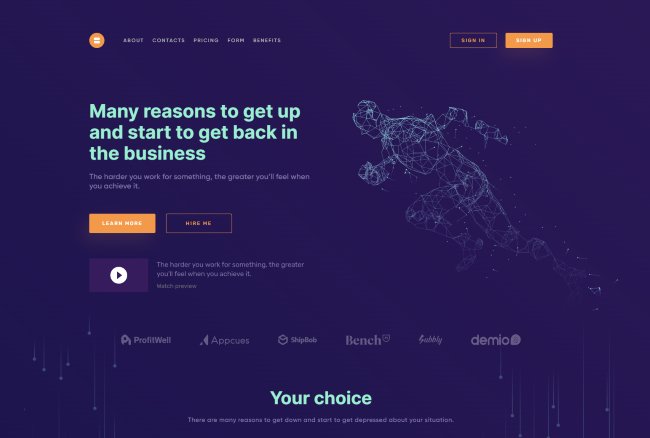
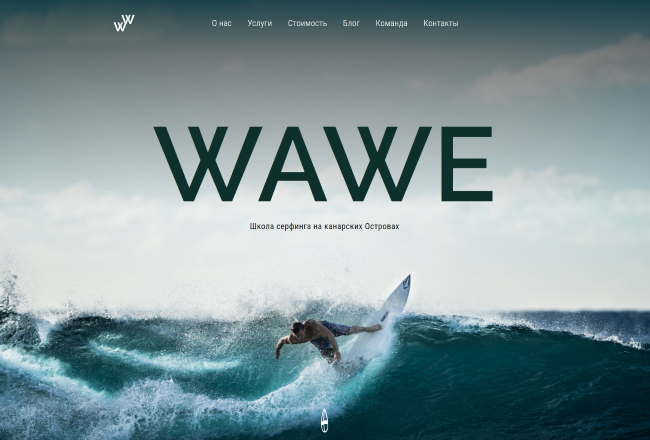
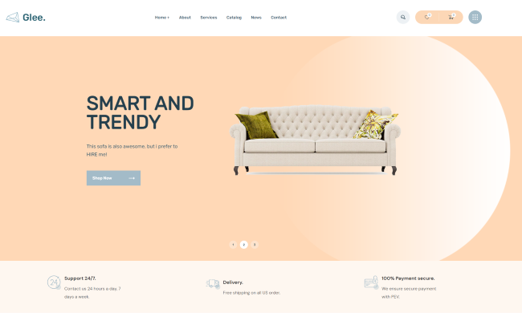

# 
Hi there 👋, I'm Bulat

### I'm a FrontEnd Developer

- 💪 Like to write code
- 🥅 Constantly learning new things
- 🖥️ Like create new features
- 🌟 Love automate routine tasks in my life

 

### BIO

I've been studying the frontend direction for a year and a half, quietly making up websites, taking courses. Recently I realized that I was wasting my time. I'm
just learning and that's it. It's time to gain experience. Rechecked all my work in the portfolio, redid the Github profile. I hope to find a job soon. 

### Connect with me:

[][vk]
[][tg]
[][gmail]

 

## 💥Portfolio💥

[**Data processing**](https://github.com/virage81/Data-Processing)

[**Wawe**](https://github.com/virage81/Wawe)

[**Glee online shop**](https://github.com/virage81/Glee)

### Languages:

  

 
 

### What i'm learning:

[vk]: https://vk.com/muzhick528
[tg]: https://t.me/Bulat_KA18
[gmail]: mailto:karimovminds@gmail.com
