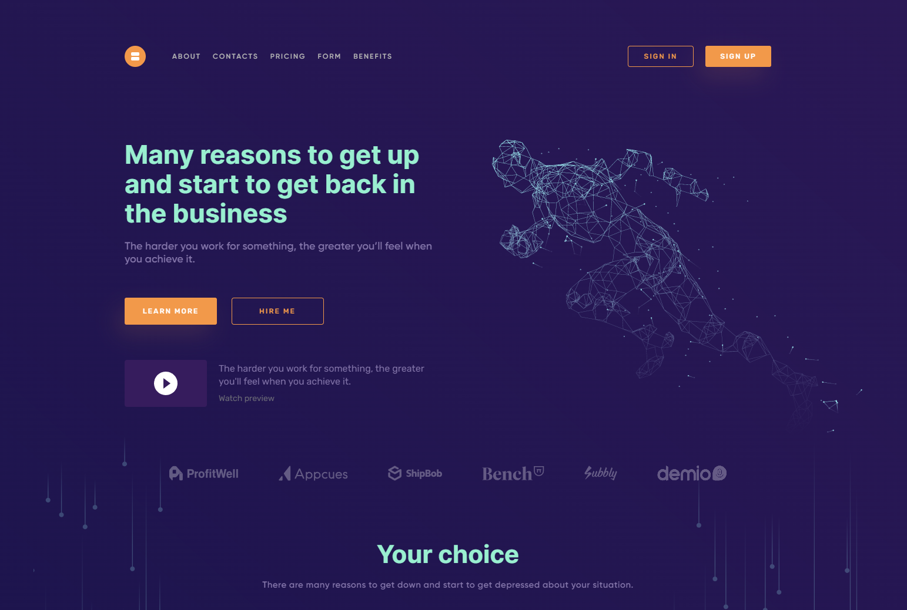
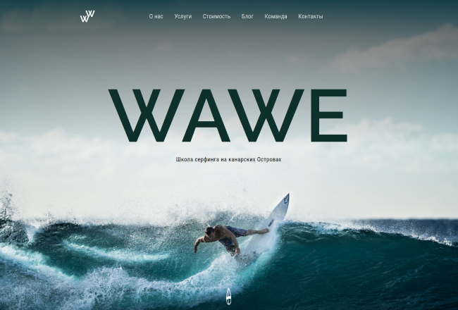
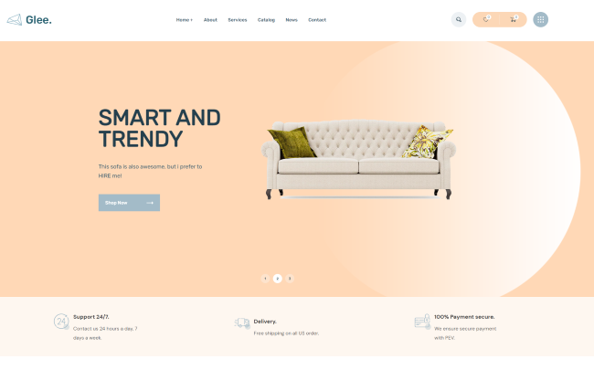

# 
Привет 👋, меня зовут Булат

### Я - фронтенд разработчик

- 💪 Люблю писать код
- 🥅 Постоянно учусь чему-то новому
- 🖥️ Люблю создавать новое
- 🌟 Нравится автоматизировать рутинные дела

 

### Биография

Я полтора года изучаю направление frontend, потихоньку создаю сайты, прохожу курсы. Недавно я понял, что напрасно трачу свое время. Я просто учусь, и все. Пришло время набираться опыта. Перепроверил все свои работы в портфолио, переделал профиль на Github. Я надеюсь скоро найти работу. 

### Контакты:

[][vk]
[][tg]
[][gmail]

 

## 💥Портфолио💥

[**Data processing**](https://github.com/virage81/Data-Processing)

[**Wawe**](https://github.com/virage81/Wawe)

[**Glee интернет-магазин**](https://github.com/virage81/Glee)

### Языки:

  

 
 

### Что учу на данный момент:

[vk]: https://vk.com/muzhick528
[tg]: https://t.me/Bulat_KA18
[gmail]: mailto:karimovminds@gmail.com
